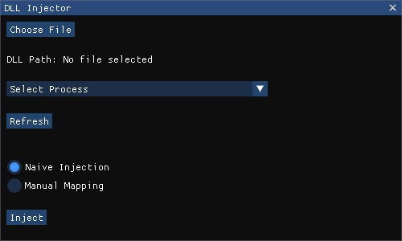
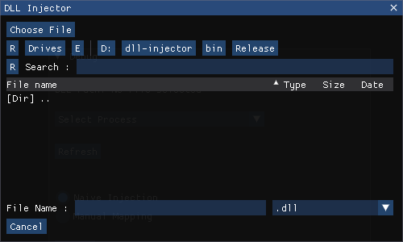

# DLL Injector

<h3 align="center">

</h3>

## About
This DLL injector, written in C++, offers simple functionalities for both naive injection and manual mapping techniques to insert the DLL into the targeted process. Additionally, it includes a user-friendly ImGUi menu, providing an easy interface for interacting with the injector.

## Features
- Naive injection
- Manual mapping

## Usage
- Download the latest release from the [releases](https://github.com/avezzu/dll-injector/releases) or compile the source code yourself and run the executable.

## Dependencies
- [GH-Injector-Library](https://github.com/Broihon/GH-Injector-Library) - manual mapping
- [imgui](https://github.com/ocornut/imgui) - gui
- [borderless-imgui-window](https://github.com/cazzwastaken/borderless-imgui-window) - gui window
- [ImGuiFileDialog](https://github.com/aiekick/ImGuiFileDialog) - ImGUI file dialog

